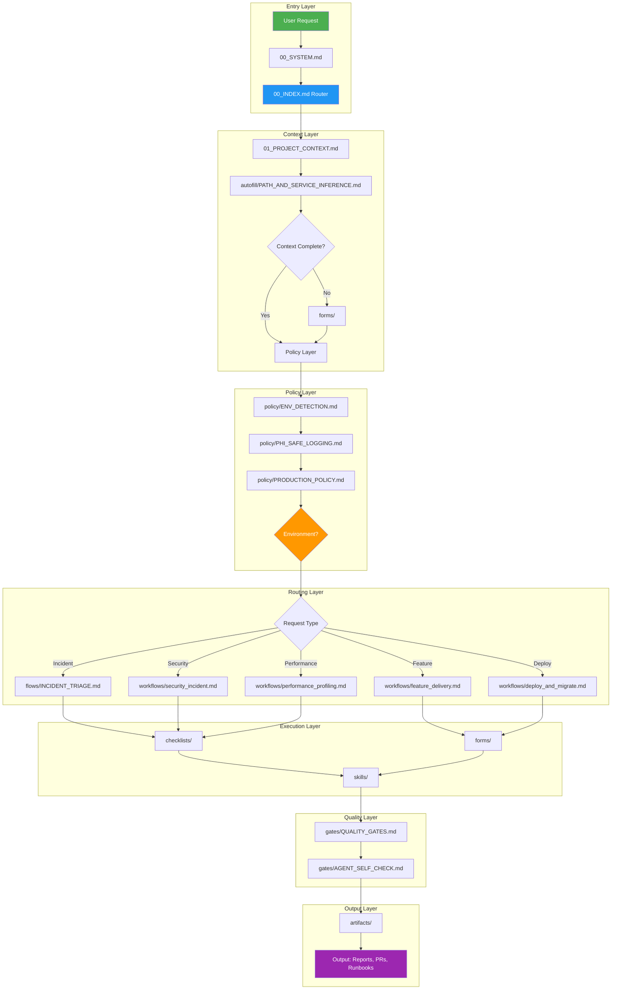
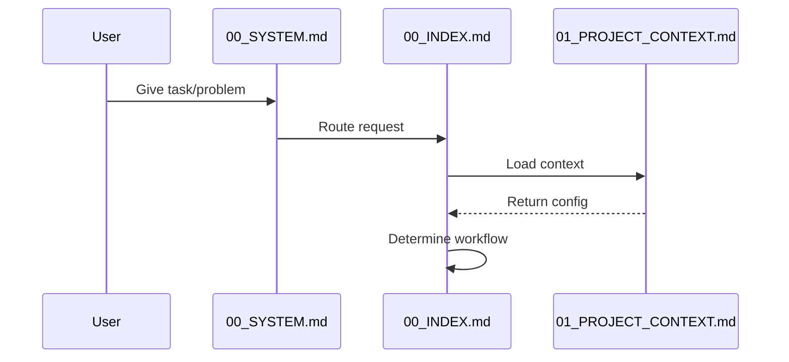
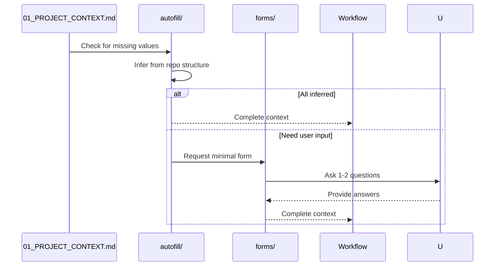
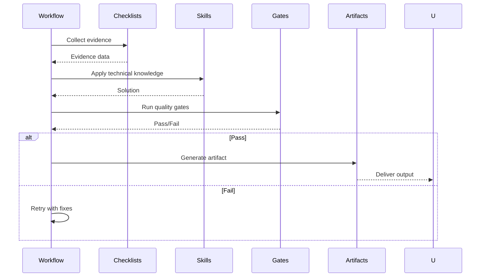
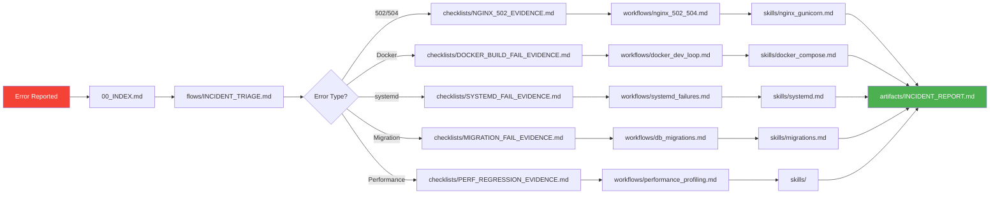
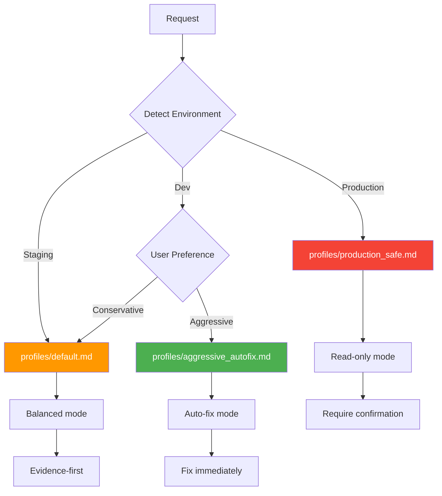
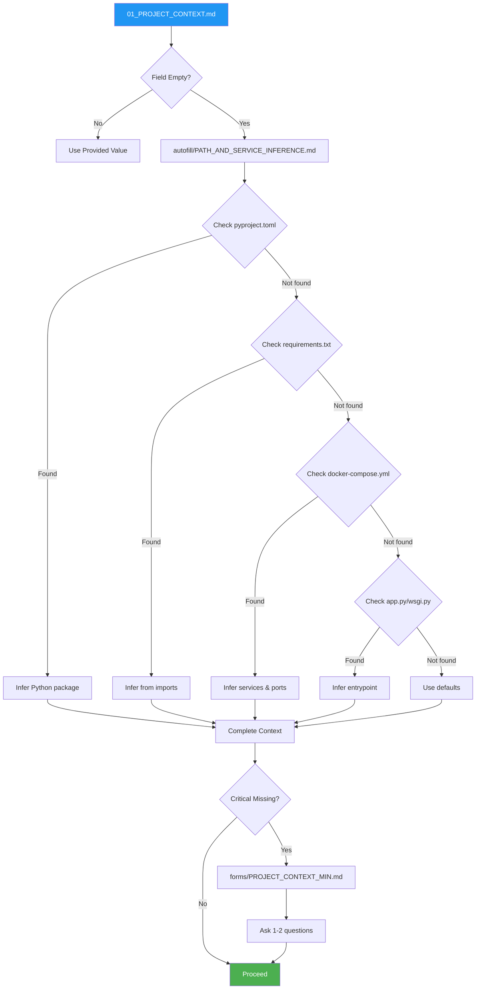
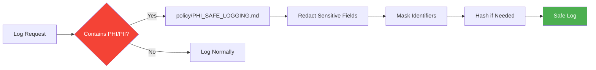
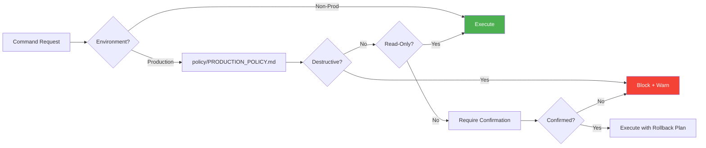

# AI Agent System Architecture

## Overview

The AI Agent MD Pack is a markdown-based configuration system that enables AI agents to autonomously handle development, testing, and maintenance tasks with minimal user input.

## System Architecture



---

## Component Interaction Flow

### 1. Request Ingestion



### 2. Context Resolution



### 3. Workflow Execution



---

## Directory Structure & Responsibilities

### Core Configuration
| File | Purpose | When Read |
|------|---------|-----------|
| `00_SYSTEM.md` | Agent behavior rules | Every request |
| `00_INDEX.md` | Request router | Every request |
| `01_PROJECT_CONTEXT.md` | Project-specific config | Every request |
| `02_CONVENTIONS.md` | Code standards | During implementation |
| `02_CONVENTIONS.md` | Fallback values | When context incomplete (See Defaults) |

### Routing & Navigation
| File | Purpose | When Used |
|------|---------|-----------|
| `REFERENCE_MAP.md` | Tag-based lookup | Cross-referencing |
| `ROUTING_RULES.md` | Keyword matching | Request classification |
| `TAXONOMY.md` | Error categorization | Incident triage |

### Workflows (End-to-End Processes)
| Directory | Contains | Purpose |
|-----------|----------|---------|
| `workflows/` | Complete processes | Feature delivery, debugging, deployment |
| `flows/` | Reusable sub-processes | Incident triage, autofix loops |

### Supporting Components
| Directory | Contains | Purpose |
|-----------|----------|---------|
| `checklists/` | Evidence collection templates | Gather diagnostic data |
| `forms/` | Minimal input templates | Get required user input |
| `policy/` | Safety & governance rules | Enforce constraints |
| `gates/` | Quality checkpoints | Validate before completion |
| `skills/` | Technical knowledge | Domain-specific expertise |
| `profiles/` | Agent behavior modes | Adjust autonomy level |
| `autofill/` | Inference rules | Minimize user input |
| `artifacts/` | Output templates | Structure deliverables |

---

## Data Flow

### Incident Response Flow



### Feature Delivery Flow


---

## Profile System

Profiles adjust agent behavior based on environment and risk tolerance:



---

## Autofill System (v4)

The autofill system minimizes user input by inferring project structure:



---

## Safety Layers

### PHI/PII Protection



### Production Safety



---

## Extension Points

### Adding Custom Workflows

1. Create `workflows/your_workflow.md`
2. Follow template structure:
   ```markdown
   # Workflow: Your Workflow Name
   
   Inputs: forms/YOUR_FORM.md
   
   ## 1) Step One
   ## 2) Step Two
   ## 3) Output
   ```
3. Add to `REFERENCE_MAP.md`:
   ```
   - WORKFLOW:YOUR_WORKFLOW → workflows/your_workflow.md
   ```
4. Update routing in `00_INDEX.md` when adding new request types

### Adding Custom Skills

1. Create `skills/your_skill.md`
2. Document technical knowledge
3. Reference from workflows

### Adding Custom Policies

1. Create `policy/YOUR_POLICY.md`
2. Define rules and constraints
3. Reference from `00_INDEX.md` non-negotiables

---

## Performance Characteristics

| Operation | Complexity | Notes |
|-----------|------------|-------|
| Request routing | O(1) | Direct lookup via 00_INDEX.md |
| Context resolution | O(n) | n = number of inference rules |
| Workflow execution | O(m) | m = workflow steps |
| Quality gates | O(k) | k = number of tests |

---

## Design Principles

1. **Minimal User Input** - Autofill infers 80% of configuration
2. **Safety First** - PHI/PII protection and production safety by default
3. **Evidence-Based** - Collect data before acting
4. **Incremental** - Small, verifiable changes
5. **Documented** - Every action produces an artifact
6. **Extensible** - Easy to add workflows, skills, policies

---

## Future Enhancements

- [ ] Multi-language support (beyond Python/Flask)
- [ ] Kubernetes workflow integration
- [ ] Advanced monitoring integration (Prometheus, Grafana)
- [ ] CI/CD pipeline templates
- [ ] Cost optimization workflows
- [ ] Compliance audit workflows (SOC2, HIPAA)

---

**See Also:**
- [`README.md`](README.md) - Overview and quick start
- [`00_INDEX.md`](00_INDEX.md) - Main router
- [`01_PROJECT_CONTEXT.md`](01_PROJECT_CONTEXT.md) - Configuration
