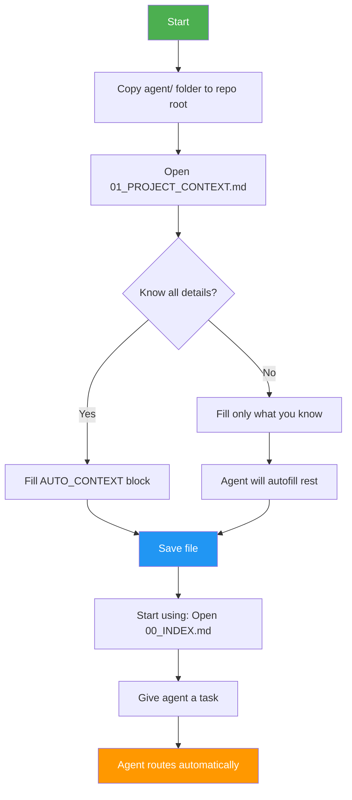

# Quickstart (30 seconds)

## Setup Steps



### 1) **Copy** the `agent/` folder into your repo root

```bash
# From this template repo
cp -r agent/ /path/to/your/project/

# Or clone and copy
git clone <this-repo-url>
cp -r ai-agent-md-pack/ai /path/to/your/project/
```

### 2) **Fill once**: `agent/01_PROJECT_CONTEXT.md`

Open the file and fill the `AUTO_CONTEXT` YAML block. **Fill only what you know** - leave the rest blank.

**Minimum required:**
- `app_name` - Your application name
- `env` - dev, staging, or production

**Everything else is optional** - the agent will infer from your repo structure.

**Example:**
```yaml
app_name: "my-flask-app"
env: "dev"
domain: "localhost"
# Leave rest blank - agent will detect
```

### 3) **Start** with the entrypoint: `agent/00_INDEX.md`

Tell your AI agent to read `agent/00_INDEX.md` and give it a task using short commands from `agent/QUICK_REFERENCE.md`.

---

## Common First Tasks

### Scenario 1: Fix an Error
```
You: "fix this error: [paste traceback]"

Agent will:
1. Read 01_PROJECT_CONTEXT.md
2. Route via 00_INDEX.md → INCIDENT_TRIAGE
3. Collect evidence
4. Propose fix
5. Generate INCIDENT_REPORT.md
```

### Scenario 2: Add a Feature
```
You: "implement feature: user login with email"

Agent will:
1. Read 01_PROJECT_CONTEXT.md
2. Route via 00_INDEX.md → FEATURE_DELIVERY
3. Fill FEATURE_MIN.md
4. Create implementation plan
5. Write code + tests
6. Generate PR_SUMMARY.md
```

### Scenario 3: Deploy to Staging
```
You: "deploy to staging"

Agent will:
1. Read 01_PROJECT_CONTEXT.md
2. Detect environment
3. Route via 00_INDEX.md → DEPLOY_MIGRATE
4. Run quality gates
5. Execute deployment
6. Generate RUNBOOK.md
```

---

## What Happens Next?

The agent should **not ask for deep prompts**—only minimal forms when needed:
- `agent/forms/INCIDENT_MIN.md` - For incidents (8 fields)
- `agent/forms/FEATURE_MIN.md` - For features (5 fields)
- `agent/forms/DEPLOY_MIN.md` - For deployments (6 fields)

---

## Autofill (v4)

The autofill system minimizes your input:

1. **You provide minimal context** in `01_PROJECT_CONTEXT.md`
2. **Agent infers** using `autofill/PATH_AND_SERVICE_INFERENCE.md`:
   - Flask app structure
   - Docker Compose services
   - Log file locations
   - Port numbers
   - Database configuration
3. **Agent asks** only critical missing info (1-2 questions max)

**Example inference:**
```
You fill:
  app_name: "myapp"
  env: "dev"

Agent infers:
  backend_dir: "." (found app.py in root)
  entrypoint: "app:app" (found app.py with app object)
  app_port: 8000 (found in docker-compose.yml)
  compose_backend_service: "web" (found service with gunicorn)
  python_package: "myapp" (found myapp/__init__.py)
```

---

## Troubleshooting

### Agent asking too many questions?
- Fill more fields in `01_PROJECT_CONTEXT.md` → `AUTO_CONTEXT`
- Check that your project follows standard conventions
- Review `autofill/PATH_AND_SERVICE_INFERENCE.md` for expected structure

### Agent not finding files?
- Verify `repo_root` in `01_PROJECT_CONTEXT.md`
- Check that you have `pyproject.toml` or `requirements.txt`
- Ensure standard directory structure (app/, backend/, etc.)

### Wrong workflow selected?
- Use more specific keywords (see `QUICK_REFERENCE.md`)
- Check `ROUTING_RULES.md` for keyword triggers
- Manually specify: "use workflow: nginx_502_504.md"

### Production safety blocking actions?
- Verify `env` in `01_PROJECT_CONTEXT.md`
- Check `policy/ENV_DETECTION.md` for detection rules
- Use `profiles/default.md` for dev/staging

---

## Next Steps

- **Read:** [`00_INDEX.md`](file:///home/programmer/Desktop/projects/aiims/ai-agent-md-pack/agent/00_INDEX.md) - Main router
- **Commands:** [`QUICK_REFERENCE.md`](file:///home/programmer/Desktop/projects/aiims/ai-agent-md-pack/agent/QUICK_REFERENCE.md) - Quick command reference
- **Customize:** [`02_CONVENTIONS.md`](file:///home/programmer/Desktop/projects/aiims/ai-agent-md-pack/agent/02_CONVENTIONS.md) - Your coding standards
- **Full docs:** [`README.md`](file:///home/programmer/Desktop/projects/aiims/ai-agent-md-pack/agent/README.md) - Complete documentation

---

**That's it!** You're ready to use AI agents for development, testing, and maintenance.
