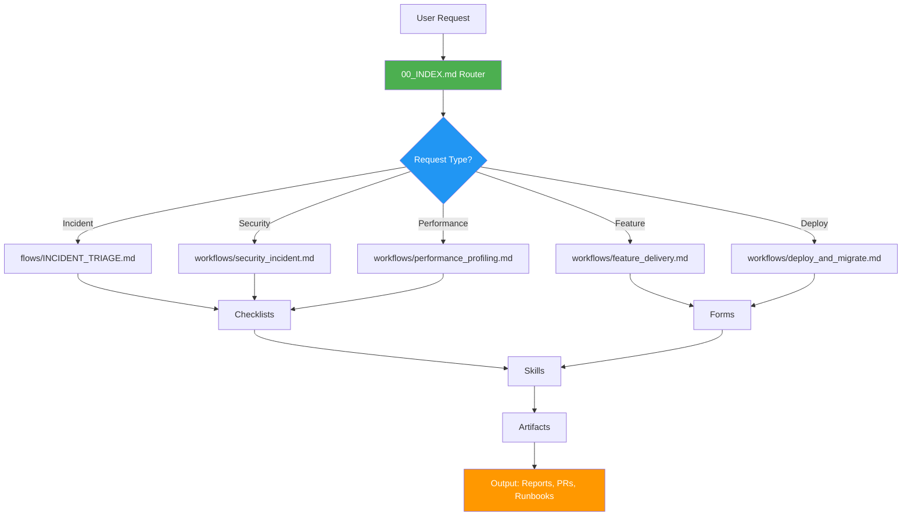

# AI Agent Configuration Pack

**Version:** 4.1  
**Last Updated:** 2026-01-05  
**Purpose:** Drop-in markdown configuration for AI-powered development, testing, and maintenance

**🌟 NEW: Universal Project Support** - Works with ANY language, framework, or build system!

---

## 🎯 Works With Everything

**Languages:** Python • C++ • Java • Go • Rust • Flutter • JavaScript • HTML/CSS • and more  
**Build Systems:** CMake • Makefile • Maven • Gradle • Cargo • npm • UV • pip • and more  
**Frameworks:** Flask • React • Spring Boot • Express • FastAPI • Next.js • and more  
**Deployment:** Docker • systemd • Kubernetes • Serverless • Manual

**→ See [`UNIVERSAL_SUPPORT.md`](UNIVERSAL_SUPPORT.md) for complete list**

---

## 🚀 Quick Start

1. **Copy** this `agent/` folder to your project root
2. **Fill** [`01_PROJECT_CONTEXT.md`](file:///home/programmer/Desktop/projects/aiims/ai-agent-md-pack/agent/01_PROJECT_CONTEXT.md) (5 minutes)
3. **Start** using AI agents via [`00_INDEX.md`](file:///home/programmer/Desktop/projects/aiims/ai-agent-md-pack/agent/00_INDEX.md)

See [`QUICKSTART.md`](file:///home/programmer/Desktop/projects/aiims/ai-agent-md-pack/agent/QUICKSTART.md) for detailed setup.

---

## 📋 What This Pack Provides

### Core Capabilities
- ✅ **Incident Response** - Automated triage, diagnosis, and fix loops
- ✅ **Feature Delivery** - Spec → tasks → implementation → PR
- ✅ **DevOps Automation** - Docker, systemd, nginx, database migrations
- ✅ **Security** - PHI/PII-safe logging, vulnerability detection
- ✅ **Performance** - Profiling, regression detection, optimization
- ✅ **Quality Gates** - Automated testing, linting, code review

### Technology Stack Support
- **Backend:** Flask, FastAPI, Gunicorn, Uvicorn, **Spring Boot (Java), C++ (CMake)**
- **Frontend:** React, Vite, Tailwind CSS, Flutter
- **Infrastructure:** **Docker (Hardening & Optimization)**, Docker Compose, systemd, Nginx
- **Databases:** PostgreSQL, MySQL, SQLite, MongoDB
- **Tools:** Alembic, pytest, ruff, black, **Maven, Gradle, Valgrind, GDB, Clang-Tidy**

---

## 🏗️ Architecture



---

## 📁 Directory Structure

```
agent/
├── 00_INDEX.md              # Main router - START HERE
├── 00_SYSTEM.md             # System instructions for AI agents
├── 01_PROJECT_CONTEXT.md    # Project-specific configuration
├── QUICKSTART.md            # 30-second setup guide
├── REFERENCE_MAP.md         # Tag-based navigation
│
├── workflows/               # End-to-end processes
│   ├── feature_delivery.md
│   ├── nginx_502_504.md
│   ├── deploy_and_migrate.md
│   └── ...
│
├── flows/                   # Reusable process flows
│   ├── INCIDENT_TRIAGE.md
│   └── AUTOFIX_LOOP.md
│
├── checklists/              # Evidence collection
│   ├── NGINX_502_EVIDENCE.md
│   ├── DOCKER_BUILD_FAIL_EVIDENCE.md
│   └── ...
│
├── policy/                  # Safety and governance
│   ├── PHI_SAFE_LOGGING.md
│   ├── PRODUCTION_POLICY.md
│   └── ...
│
├── forms/                   # Minimal input templates
│   ├── INCIDENT_MIN.md
│   ├── FEATURE_MIN.md
│   └── ...
│
├── artifacts/               # Output templates
│   ├── INCIDENT_REPORT.md
│   ├── PR_SUMMARY.md
│   └── ...
│
├── skills/                  # Technical knowledge base
│   ├── nginx_gunicorn.md
│   ├── docker_compose.md
│   └── ...
│
├── profiles/                # Agent behavior modes
│   ├── default.md
│   ├── production_safe.md
│   └── aggressive_autofix.md
│
└── autofill/                # Smart defaults system
    ├── PATH_AND_SERVICE_INFERENCE.md
    └── AUTOFILL_VARIABLES.md
```

---

## 🎯 Usage Patterns

### Pattern 1: Incident Response
```
User: "fix this error: [paste traceback]"
  ↓
Agent reads: 00_INDEX.md → flows/INCIDENT_TRIAGE.md
  ↓
Agent fills: forms/INCIDENT_MIN.md
  ↓
Agent collects: checklists/NGINX_502_EVIDENCE.md
  ↓
Agent executes: workflows/nginx_502_504.md
  ↓
Agent outputs: artifacts/INCIDENT_REPORT.md
```

### Pattern 2: Feature Development
```
User: "implement feature: user authentication"
  ↓
Agent reads: 00_INDEX.md → workflows/feature_delivery.md
  ↓
Agent fills: forms/FEATURE_MIN.md
  ↓
Agent plans: artifacts/DECISION_RECORD.md
  ↓
Agent implements: with testing/TEST_STRATEGY.md
  ↓
Agent outputs: artifacts/PR_SUMMARY.md
```

### Pattern 3: Deployment
```
User: "deploy to staging"
  ↓
Agent reads: 00_INDEX.md → workflows/deploy_and_migrate.md
  ↓
Agent fills: forms/DEPLOY_MIN.md
  ↓
Agent checks: policy/ENV_DETECTION.md
  ↓
Agent executes: with gates/QUALITY_GATES.md
  ↓
Agent outputs: artifacts/RUNBOOK.md
```

---

## 🔑 Key Features

### 1. Autofill System (v4)
Minimizes user input by inferring project structure:
- Detects Flask app structure automatically
- Infers Docker Compose service names
- Discovers log locations and ports
- Falls back to safe production defaults

See [`autofill/PATH_AND_SERVICE_INFERENCE.md`](file:///home/programmer/Desktop/projects/aiims/ai-agent-md-pack/agent/autofill/PATH_AND_SERVICE_INFERENCE.md)

### 2. PHI/PII Safety
Built-in privacy protection for healthcare and sensitive data:
- Never logs authorization tokens or PHI fields
- Automatic redaction of sensitive data
- Safe request logging patterns
- HIPAA/GDPR-aware defaults

See [`policy/PHI_SAFE_LOGGING.md`](file:///home/programmer/Desktop/projects/aiims/ai-agent-md-pack/agent/policy/PHI_SAFE_LOGGING.md)

### 3. Production Safety
Read-only mode for production environments:
- Automatic environment detection
- Blocks destructive commands in production
- Requires explicit confirmation for risky operations
- Rollback plans for all changes

See [`policy/PRODUCTION_POLICY.md`](file:///home/programmer/Desktop/projects/aiims/ai-agent-md-pack/agent/policy/PRODUCTION_POLICY.md)

### 4. Quality Gates
Automated quality checks before completion:
- Linting and formatting (ruff/black)
- Test execution (pytest)
- Security baseline checks
- Code review preparation

See [`gates/QUALITY_GATES.md`](file:///home/programmer/Desktop/projects/aiims/ai-agent-md-pack/agent/gates/QUALITY_GATES.md)

---

## 🎨 Agent Profiles

Choose the right profile for your environment:

| Profile | Use Case | Auto-Fix | Write Access |
|---------|----------|----------|--------------|
| **default** | Development & staging | ✅ Yes | ✅ Yes |
| **production_safe** | Production environments | ❌ No | ❌ Read-only |
| **aggressive_autofix** | Dev with high confidence | ✅✅ Aggressive | ✅ Yes |

See [`profiles/`](file:///home/programmer/Desktop/projects/aiims/ai-agent-md-pack/agent/profiles/) directory

---

## 📚 Common Workflows

### Debugging
- [`workflows/debug_basic.md`](file:///home/programmer/Desktop/projects/aiims/ai-agent-md-pack/agent/workflows/debug_basic.md) - General Python/Flask bugs
- [`workflows/nginx_502_504.md`](file:///home/programmer/Desktop/projects/aiims/ai-agent-md-pack/agent/workflows/nginx_502_504.md) - Reverse proxy errors
- [`workflows/systemd_failures.md`](file:///home/programmer/Desktop/projects/aiims/ai-agent-md-pack/agent/workflows/systemd_failures.md) - Service failures

### Development
- [`workflows/feature_delivery.md`](file:///home/programmer/Desktop/projects/aiims/ai-agent-md-pack/agent/workflows/feature_delivery.md) - Feature implementation
- [`workflows/docker_dev_loop.md`](file:///home/programmer/Desktop/projects/aiims/ai-agent-md-pack/agent/workflows/docker_dev_loop.md) - Docker development setup

### Operations
- [`workflows/deploy_and_migrate.md`](file:///home/programmer/Desktop/projects/aiims/ai-agent-md-pack/agent/workflows/deploy_and_migrate.md) - Deployment process
- [`workflows/maintenance_mode.md`](file:///home/programmer/Desktop/projects/aiims/ai-agent-md-pack/agent/workflows/maintenance_mode.md) - Maintenance windows
- [`workflows/rollback_recovery.md`](file:///home/programmer/Desktop/projects/aiims/ai-agent-md-pack/agent/workflows/rollback_recovery.md) - Rollback procedures

### Security
- [`workflows/security_incident.md`](file:///home/programmer/Desktop/projects/aiims/ai-agent-md-pack/agent/workflows/security_incident.md) - Security response
- [`workflows/security_sqli_path.md`](file:///home/programmer/Desktop/projects/aiims/ai-agent-md-pack/agent/workflows/security_sqli_path.md) - SQLi/path traversal

### Performance
- [`workflows/performance_profiling.md`](file:///home/programmer/Desktop/projects/aiims/ai-agent-md-pack/agent/workflows/performance_profiling.md) - Performance analysis
- [`workflows/performance.md`](file:///home/programmer/Desktop/projects/aiims/ai-agent-md-pack/agent/workflows/performance.md) - Optimization

---

## 🛠️ Customization

### For Your Project
1. Fill [`01_PROJECT_CONTEXT.md`](file:///home/programmer/Desktop/projects/aiims/ai-agent-md-pack/agent/01_PROJECT_CONTEXT.md) with your project details
2. Adjust [`02_CONVENTIONS.md`](file:///home/programmer/Desktop/projects/aiims/ai-agent-md-pack/agent/02_CONVENTIONS.md) for your coding standards
3. Modify [`02_CONVENTIONS.md`](file:///home/programmer/Desktop/projects/aiims/ai-agent-md-pack/agent/02_CONVENTIONS.md) for your stack preferences (Defaults section)

### Adding Custom Workflows
1. Create new file in `workflows/`
2. Follow existing template structure
3. Add reference to [`REFERENCE_MAP.md`](file:///home/programmer/Desktop/projects/aiims/ai-agent-md-pack/agent/REFERENCE_MAP.md)
4. Update routing in [`00_INDEX.md`](file:///home/programmer/Desktop/projects/aiims/ai-agent-md-pack/agent/00_INDEX.md) when adding new request types

---

## 🔍 Navigation

### By Tag
Use [`REFERENCE_MAP.md`](file:///home/programmer/Desktop/projects/aiims/ai-agent-md-pack/agent/REFERENCE_MAP.md) for tag-based lookup:
- `FLOW:INCIDENT_TRIAGE` → incident handling
- `WORKFLOW:NGINX_502_504` → nginx debugging
- `POLICY:PHI_SAFE` → privacy protection
- `ARTIFACT:PR_SUMMARY` → PR template

### By Keyword
Use [`ROUTING_RULES.md`](file:///home/programmer/Desktop/projects/aiims/ai-agent-md-pack/agent/ROUTING_RULES.md) for keyword-based routing:
- "502", "504" → nginx workflows
- "docker build" → docker checklists
- "slow", "timeout" → performance workflows

---

## 📖 Documentation

- **Setup:** [`QUICKSTART.md`](file:///home/programmer/Desktop/projects/aiims/ai-agent-md-pack/agent/QUICKSTART.md), [`COPY_INTO_NEW_REPO.md`](file:///home/programmer/Desktop/projects/aiims/ai-agent-md-pack/agent/COPY_INTO_NEW_REPO.md)
- **Commands:** [`QUICK_REFERENCE.md`](file:///home/programmer/Desktop/projects/aiims/ai-agent-md-pack/agent/QUICK_REFERENCE.md) - Quick command reference
- **Taxonomy:** [`TAXONOMY.md`](file:///home/programmer/Desktop/projects/aiims/ai-agent-md-pack/agent/TAXONOMY.md) - Error classification
- **Version:** [`CHANGELOG.md`](file:///home/programmer/Desktop/projects/aiims/ai-agent-md-pack/agent/CHANGELOG.md) - Changelog

---

## 🚦 Best Practices

### For Users
1. **Start minimal** - Fill only what you know in `01_PROJECT_CONTEXT.md`
2. **Use short commands** - See `QUICK_REFERENCE.md` for examples
3. **Trust autofill** - Let the agent infer missing details
4. **Review outputs** - Check generated artifacts before committing

### For Agents
1. **Read context first** - Always start with `01_PROJECT_CONTEXT.md`
2. **Follow routing** - Use `00_INDEX.md` to determine workflow
3. **Collect evidence** - Run appropriate checklists before fixing
4. **Respect policies** - Never violate PHI/PII or production safety
5. **Pass quality gates** - Run tests and lints before completion

---

## 🔄 Version History

### v4 (2026-01-04) - Current
- ✨ Autofill system for project inference
- ✨ Structured context schema
- ✨ Path and service auto-detection
- 🔧 Improved routing logic

### v3 (Previous)
- Initial workflow system
- Basic policy framework
- Artifact templates

See [`CHANGELOG.md`](file:///home/programmer/Desktop/projects/aiims/ai-agent-md-pack/agent/CHANGELOG.md) for details

---

## 🤝 Contributing

To improve this pack:
1. Add new workflows to `workflows/`
2. Enhance skills in `skills/`
3. Create better artifact templates in `artifacts/`
4. Improve autofill rules in `autofill/`

---

## 📄 License

This configuration pack is designed to be copied and customized for your projects.

---

## 🆘 Troubleshooting

### Agent not finding files?
- Check that `01_PROJECT_CONTEXT.md` has correct `repo_root`
- Verify autofill rules in `autofill/PATH_AND_SERVICE_INFERENCE.md`

### Wrong workflow selected?
- Review routing rules in `00_INDEX.md`
- Check keyword matching in `ROUTING_RULES.md`

### Production safety blocking needed actions?
- Verify environment detection in `policy/ENV_DETECTION.md`
- Consider using `profiles/default.md` for non-production

### Need more help?
- Review [`QUICKSTART.md`](file:///home/programmer/Desktop/projects/aiims/ai-agent-md-pack/agent/QUICKSTART.md)
- Check relevant workflow in `workflows/`
- Consult skill documentation in `skills/`

---

**Ready to start?** → [`QUICKSTART.md`](file:///home/programmer/Desktop/projects/aiims/ai-agent-md-pack/agent/QUICKSTART.md)
