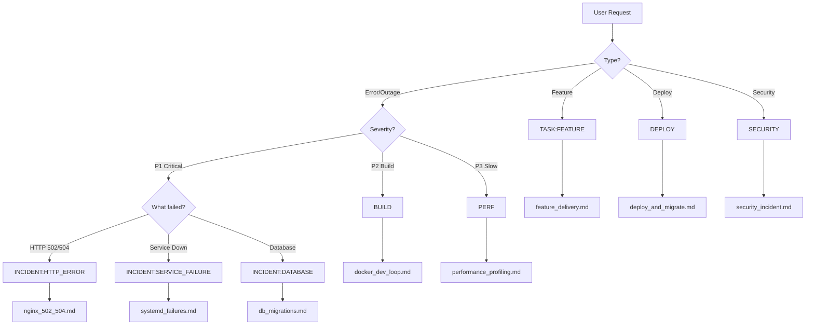

# Error/Task Taxonomy

**Purpose:** Categorize all types of errors and tasks for proper routing
**When to use:** When classifying incidents or requests
**Output:** Category → Workflow mapping

---

## 🔴 Production Incidents (P1 - Immediate)

### HTTP/Proxy Errors
**Category:** `INCIDENT:HTTP_ERROR`  
**Symptoms:** 502, 504, 5xx, bad gateway, upstream timeout  
**Root Causes:**
- Nginx misconfiguration
- Gunicorn not running
- App crashed
- Timeout mismatch
- Upstream unreachable

**Route to:** [`workflows/nginx_502_504.md`](workflows/nginx_502_504.md)

---

### Service Failures
**Category:** `INCIDENT:SERVICE_FAILURE`  
**Symptoms:** Service inactive, dead, failed to start  
**Root Causes:**
- Missing dependencies
- Permission issues
- Config errors
- Port already in use
- OOM killer

**Route to:** [`workflows/systemd_failures.md`](workflows/systemd_failures.md)

---

### Database Issues
**Category:** `INCIDENT:DATABASE`  
**Symptoms:** Connection refused, deadlock, constraint violation  
**Root Causes:**
- DB server down
- Too many connections
- Lock timeout
- Schema mismatch
- Migration failed

**Route to:** [`workflows/db_migrations.md`](workflows/db_migrations.md)

---

## 🟡 Build & Deploy Issues (P2)

### Docker Build Failures
**Category:** `BUILD:DOCKER`  
**Symptoms:** Build failed, no space, permission denied  
**Root Causes:**
- Disk full
- Invalid Dockerfile
- Missing dependencies
- Network issues
- Permission problems

**Route to:** [`workflows/docker_dev_loop.md`](workflows/docker_dev_loop.md)

---

### Migration Failures
**Category:** `DEPLOY:MIGRATION`  
**Symptoms:** Alembic error, revision conflict, schema mismatch  
**Root Causes:**
- Conflicting migrations
- Missing dependencies
- Schema drift
- Data incompatibility
- Rollback needed

**Route to:** [`workflows/db_migrations.md`](workflows/db_migrations.md)

---

### Deployment Failures
**Category:** `DEPLOY:FAILURE`  
**Symptoms:** Deploy failed, rollout stuck, health check failing  
**Root Causes:**
- Config mismatch
- Missing secrets
- Health check timeout
- Resource limits
- Network issues

**Route to:** [`workflows/deploy_and_migrate.md`](workflows/deploy_and_migrate.md)

---

## 🟢 Performance Issues (P3)

### Latency/Slowness
**Category:** `PERF:LATENCY`  
**Symptoms:** Slow requests, timeouts, high response time  
**Root Causes:**
- Database slow queries
- N+1 queries
- Missing indexes
- Memory leak
- CPU bottleneck

**Route to:** [`workflows/performance_profiling.md`](workflows/performance_profiling.md)

---

### Resource Exhaustion
**Category:** `PERF:RESOURCE`  
**Symptoms:** High CPU, high memory, disk full  
**Root Causes:**
- Memory leak
- Infinite loop
- Large dataset
- No cleanup
- Resource limits

**Route to:** [`workflows/performance_profiling.md`](workflows/performance_profiling.md)

---

## 🔒 Security Issues (P4)

### Injection Attacks
**Category:** `SECURITY:INJECTION`  
**Symptoms:** SQL injection, command injection, XSS  
**Root Causes:**
- Unvalidated input
- No parameterization
- Missing sanitization
- Unsafe eval
- Template injection

**Route to:** [`workflows/security_incident.md`](workflows/security_incident.md)

---

### Path Traversal
**Category:** `SECURITY:PATH_TRAVERSAL`  
**Symptoms:** Unauthorized file access, directory traversal  
**Root Causes:**
- Unvalidated paths
- Missing sanitization
- Unsafe file operations
- No allowlist

**Route to:** [`workflows/security_sqli_path.md`](workflows/security_sqli_path.md)

---

### Authentication/Authorization
**Category:** `SECURITY:AUTH`  
**Symptoms:** Unauthorized access, privilege escalation  
**Root Causes:**
- Weak authentication
- Missing authorization
- Token issues
- Session hijacking
- CSRF vulnerability

**Route to:** [`workflows/security_incident.md`](workflows/security_incident.md)

---

## 🔵 Feature Development (P5)

### New Features
**Category:** `TASK:FEATURE`  
**Description:** Implementing new functionality  
**Process:**
1. Spec → Design → Implementation → Testing → Review

**Route to:** [`workflows/feature_delivery.md`](workflows/feature_delivery.md)

---

### Refactoring
**Category:** `TASK:REFACTOR`  
**Description:** Code cleanup, optimization, restructuring  
**Process:**
1. Identify → Plan → Refactor → Test → Review

**Route to:** [`workflows/feature_delivery.md`](workflows/feature_delivery.md)

---

### Bug Fixes
**Category:** `TASK:BUGFIX`  
**Description:** Fixing non-critical bugs  
**Process:**
1. Reproduce → Debug → Fix → Test → Review

**Route to:** [`workflows/debug_basic.md`](workflows/debug_basic.md)

---

## 🟣 Operations (P6)

### Rollback
**Category:** `OPS:ROLLBACK`  
**Description:** Reverting to previous version  
**Triggers:**
- Deployment failed
- Critical bug
- Performance regression
- Data corruption

**Route to:** [`workflows/rollback_recovery.md`](workflows/rollback_recovery.md)

---

### Maintenance
**Category:** `OPS:MAINTENANCE`  
**Description:** Scheduled maintenance windows  
**Activities:**
- Database maintenance
- Server updates
- Cleanup operations
- Backup verification

**Route to:** [`workflows/maintenance_mode.md`](workflows/maintenance_mode.md)

---

## Decision Tree



---

## Category Mapping

| Category | Priority | Checklist | Workflow |
|----------|----------|-----------|----------|
| `INCIDENT:HTTP_ERROR` | P1 | NGINX_502 | nginx_502_504 |
| `INCIDENT:SERVICE_FAILURE` | P1 | SYSTEMD_FAIL | systemd_failures |
| `INCIDENT:DATABASE` | P1 | MIGRATION_FAIL | db_migrations |
| `BUILD:DOCKER` | P2 | DOCKER_BUILD | docker_dev_loop |
| `DEPLOY:MIGRATION` | P2 | MIGRATION_FAIL | db_migrations |
| `DEPLOY:FAILURE` | P2 | - | deploy_and_migrate |
| `PERF:LATENCY` | P3 | PERF_REGRESSION | performance_profiling |
| `PERF:RESOURCE` | P3 | PERF_REGRESSION | performance_profiling |
| `SECURITY:INJECTION` | P4 | - | security_incident |
| `SECURITY:PATH_TRAVERSAL` | P4 | - | security_sqli_path |
| `SECURITY:AUTH` | P4 | - | security_incident |
| `TASK:FEATURE` | P5 | - | feature_delivery |
| `TASK:REFACTOR` | P5 | - | feature_delivery |
| `TASK:BUGFIX` | P5 | - | debug_basic |
| `OPS:ROLLBACK` | P6 | - | rollback_recovery |
| `OPS:MAINTENANCE` | P6 | - | maintenance_mode |

---

## Usage Example

### Classifying an Incident
```
User: "Getting 502 errors"

1. Extract keywords: "502", "errors"
2. Match category: INCIDENT:HTTP_ERROR
3. Priority: P1 (Critical)
4. Checklist: NGINX_502_EVIDENCE
5. Workflow: nginx_502_504
```

### Classifying a Task
```
User: "Add user authentication"

1. Extract keywords: "add", "authentication"
2. Match category: TASK:FEATURE
3. Priority: P5
4. Checklist: None
5. Workflow: feature_delivery
```

---

## See Also

- [`ROUTING_RULES.md`](ROUTING_RULES.md) - Keyword-based routing
- [`REFERENCE_MAP.md`](REFERENCE_MAP.md) - File reference
- [`00_INDEX.md`](00_INDEX.md) - Main router
- [`flows/INCIDENT_TRIAGE.md`](flows/INCIDENT_TRIAGE.md) - Triage flow

