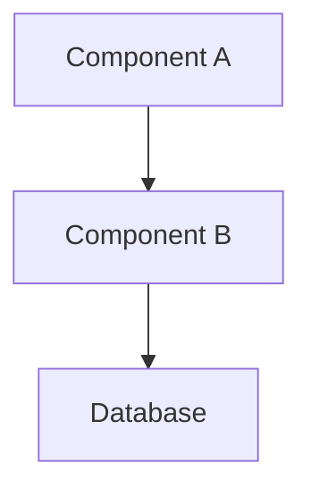

# Developer Guide: [Module/Feature Name]

## Overview
[Provide a high-level summary of the module/feature, its purpose, and how it fits into the overall system.]

## Architecture
[Describe the technical architecture, including components, data flow, and key design patterns used.]

### Mermaid Diagram (Optional)

## Setup & Prerequisites
[List dependencies, environment variables, and steps required to set up the development environment.]

## Key Components & APIs
[Detail the main classes, functions, or modules. Include reference links to source files.]
- [Component Name](file:///path/to/file.py#L10) - Brief description.

## Data Schema & Models
[Describe any database tables, JSON schemas, or data models involved.]

## Extension Points
[Explain how other developers can extend or modify this feature.]

## Troubleshooting (Internal)
[Common developer-facing issues and how to resolve them.]

---
**Author:** [Agent Name/User Name]
**Date:** [YYYY-MM-DD]
