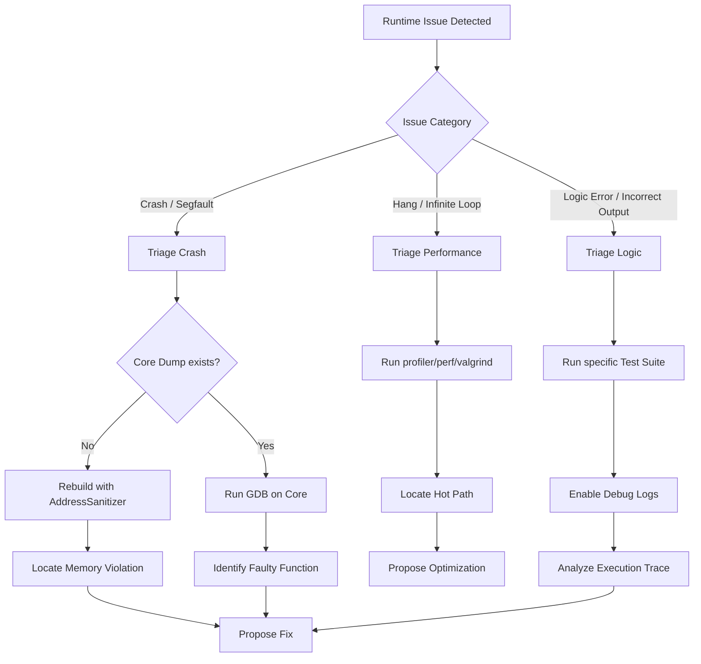

# FLOW: C++ Debugging Decision Tree

**Purpose:** Route C++ runtime issues to the correct triaging strategy.
**Source:** `flows/CPP_DEBUGGING_FLOW.md`

## 1. Crash Triage (SIGSEGV, SIGABRT)
1. **Identify signal:** Was it a `Segmentation Fault` (memory) or `Abort` (assertion/uncaught exception)?
2. **Backtrace:** Use `gdb` or `lldb` to get the stack trace.
3. **Check pointers:** Look for NULL dereference or use-after-free.

## 2. Memory Triage
1. **ASAN:** `set(CMAKE_CXX_FLAGS "${CMAKE_CXX_FLAGS} -fsanitize=address")`.
2. **Valgrind:** `valgrind --leak-check=full ./binary`.

## 3. Logic Triage
1. **Reproducer:** Create a minimal test case that fails.
2. **Assertions:** Add `assert()` or `CHECK()` macros to verify invariants.

## 4. Metadata
- `TRIAGE_TYPE`: RUNTIME
- `LANGUAGE`: CPP
- `TOOLS`: [GDB, LLDB, ASAN, VALGRIND]
