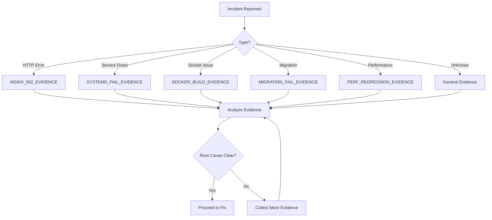

# Flow: Evidence Collection

**Purpose:** Systematic evidence collection for any incident
**When to use:** Before diagnosing or fixing any issue
**Prerequisites:** Access to system, logs, and diagnostic tools
**Outputs:** Complete evidence package for diagnosis

---

## Evidence Collection Process



---

## Step 1: Identify Incident Type

Match symptoms to checklist:

| Symptom | Checklist |
|---------|-----------|
| 502/504 errors | [`NGINX_502_EVIDENCE`](../checklists/NGINX_502_EVIDENCE.md) |
| Service won't start | [`SYSTEMD_FAIL_EVIDENCE`](../checklists/SYSTEMD_FAIL_EVIDENCE.md) |
| Docker build/run fails | [`DOCKER_BUILD_FAIL_EVIDENCE`](../checklists/DOCKER_BUILD_FAIL_EVIDENCE.md) |
| Migration fails | [`MIGRATION_FAIL_EVIDENCE`](../checklists/MIGRATION_FAIL_EVIDENCE.md) |
| Slow performance | [`PERF_REGRESSION_EVIDENCE`](../checklists/PERF_REGRESSION_EVIDENCE.md) |

---

## Step 2: Run Appropriate Checklist

Follow the checklist completely:
- [ ] Collect ALL sections (don't skip)
- [ ] Document exact error messages
- [ ] Capture relevant logs
- [ ] Note timestamps
- [ ] Record environment details

---

## Step 3: Organize Evidence

Create evidence summary:

```markdown
## Evidence Summary

**Incident ID:** INC-YYYYMMDD-NNN
**Reported:** YYYY-MM-DD HH:MM:SS
**Environment:** [dev/staging/production]
**Severity:** [P1/P2/P3/P4]

### Symptoms
- [List observed symptoms]

### Evidence Collected
- [x] Error logs
- [x] Service status
- [x] Resource metrics
- [x] Recent changes
- [x] Configuration

### Key Findings
1. [Finding 1]
2. [Finding 2]
3. [Finding 3]

### Root Cause Hypothesis
[Most likely cause based on evidence]

### Confidence Level
[HIGH/MEDIUM/LOW]
```

---

## Step 4: Validate Evidence

Before proceeding, verify:
- [ ] All required sections completed
- [ ] Evidence is factual (not assumed)
- [ ] Timestamps are accurate
- [ ] Error messages are exact (not paraphrased)
- [ ] Root cause is supported by evidence

---

## Step 5: Proceed to Diagnosis

Based on evidence, route to appropriate workflow:

| Root Cause | Workflow |
|------------|----------|
| Nginx/upstream issue | [`nginx_502_504`](../workflows/nginx_502_504.md) |
| Service failure | [`systemd_failures`](../workflows/systemd_failures.md) |
| Docker issue | [`docker_dev_loop`](../workflows/docker_dev_loop.md) |
| Migration issue | [`db_migrations`](../workflows/db_migrations.md) |
| Performance issue | [`performance_profiling`](../workflows/performance_profiling.md) |

---

## Red Flags - Stop and Recollect

Stop if you notice:
- ❌ Missing critical information
- ❌ Contradictory evidence
- ❌ Assumptions instead of facts
- ❌ No clear pattern
- ❌ Multiple possible causes

**Action:** Collect more evidence before proceeding.

---

## Evidence Storage

Save evidence for:
- Post-incident review
- Pattern analysis
- Future reference
- Compliance/audit

**Location:** `incidents/YYYYMMDD-description/evidence.md`

---

## See Also

- [`../checklists/`](../checklists/) - All evidence checklists
- [`../workflows/`](../workflows/) - Fix workflows
- [`../artifacts/incident_report.md`](../artifacts/incident_report.md) - Incident template
