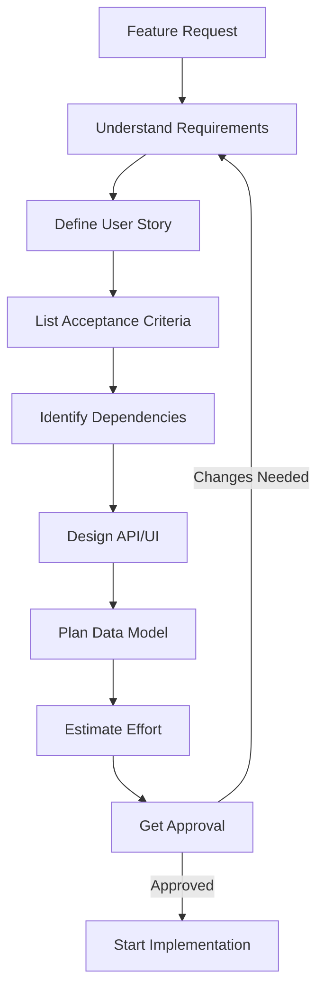

# Flow: Feature Specification

**Purpose:** Define feature requirements before implementation
**When to use:** Before starting any new feature development
**Prerequisites:** User story or feature request
**Outputs:** Complete feature specification

---

## Feature Spec Process



---

## Step 1: User Story

Define the feature as a user story:

```markdown
## User Story

**As a** [type of user]  
**I want** [goal/desire]  
**So that** [benefit/value]

### Example
As a **registered user**  
I want **to reset my password via email**  
So that **I can regain access if I forget my password**
```

---

## Step 2: Acceptance Criteria

List specific, testable criteria:

```markdown
## Acceptance Criteria

- [ ] User can request password reset from login page
- [ ] System sends reset email within 1 minute
- [ ] Reset link expires after 24 hours
- [ ] User can set new password using valid link
- [ ] Old password no longer works after reset
- [ ] User receives confirmation email after reset
- [ ] Invalid/expired links show clear error message
```

**Each criterion must be:**
- Specific (not vague)
- Testable (can verify)
- Measurable (has clear pass/fail)

---

## Step 3: API Contract (if applicable)

Define API endpoints:

```markdown
## API Endpoints

### POST /api/auth/password-reset/request
**Purpose:** Request password reset  
**Auth:** None  
**Input:**
```json
{
  "email": "user@example.com"
}
```

**Output (200):**
```json
{
  "message": "If email exists, reset link sent"
}
```

**Errors:**
- 400: Invalid email format
- 429: Too many requests

### POST /api/auth/password-reset/confirm
**Purpose:** Confirm password reset  
**Auth:** Reset token  
**Input:**
```json
{
  "token": "abc123...",
  "new_password": "SecurePass123!"
}
```

**Output (200):**
```json
{
  "message": "Password reset successful"
}
```

**Errors:**
- 400: Invalid token or weak password
- 410: Token expired
```

---

## Step 4: UI/UX Design (if applicable)

Describe user interface:

```markdown
## UI Components

### Password Reset Request Page
- Email input field (validated)
- Submit button
- Link back to login
- Success message display
- Error message display

### Password Reset Confirm Page
- New password input (with strength indicator)
- Confirm password input
- Submit button
- Password requirements list
- Success/error messages

### Email Template
- Clear subject line
- Reset link (button)
- Expiry time notice
- Security warning
```

---

## Step 5: Data Model Changes

Define database changes:

```markdown
## Data Model

### New Table: password_reset_tokens
```sql
CREATE TABLE password_reset_tokens (
    id SERIAL PRIMARY KEY,
    user_id INTEGER REFERENCES users(id),
    token VARCHAR(255) UNIQUE NOT NULL,
    expires_at TIMESTAMP NOT NULL,
    used_at TIMESTAMP,
    created_at TIMESTAMP DEFAULT NOW()
);

CREATE INDEX idx_token ON password_reset_tokens(token);
CREATE INDEX idx_user_id ON password_reset_tokens(user_id);
```

### Modified Table: users
- No changes needed
```

---

## Step 6: Dependencies

List all dependencies:

```markdown
## Dependencies

### External Services
- Email service (SendGrid/AWS SES)
- Token generation library

### Internal Dependencies
- User authentication system
- Email template system

### Configuration
- RESET_TOKEN_EXPIRY=24h
- RESET_EMAIL_FROM=noreply@example.com
- MAX_RESET_REQUESTS_PER_HOUR=3
```

---

## Step 7: Security Considerations

Identify security requirements:

```markdown
## Security

- [ ] Rate limit reset requests (3 per hour per email)
- [ ] Use cryptographically secure tokens
- [ ] Tokens expire after 24 hours
- [ ] Tokens are single-use
- [ ] Don't reveal if email exists (same message for all)
- [ ] Log all reset attempts
- [ ] Require strong password (min 8 chars, mixed case, numbers)
- [ ] Send notification email after successful reset
```

---

## Step 8: Testing Strategy

Plan how to test:

```markdown
## Testing

### Unit Tests
- Token generation
- Token validation
- Password strength validation
- Email sending

### Integration Tests
- Full reset flow
- Expired token handling
- Invalid token handling
- Rate limiting

### Manual Tests
- UI/UX flow
- Email delivery
- Error messages
- Edge cases
```

---

## Step 9: Effort Estimate

Estimate time and complexity:

```markdown
## Effort Estimate

**Complexity:** Medium  
**Estimated Time:** 2-3 days

### Breakdown
- Backend API: 4 hours
- Database migration: 1 hour
- Email templates: 2 hours
- Frontend UI: 4 hours
- Testing: 4 hours
- Documentation: 1 hour
- Code review: 2 hours

**Total:** 18 hours (~2.5 days)
```

---

## Step 10: Get Approval

Before implementation:
- [ ] Spec reviewed by team
- [ ] Security reviewed
- [ ] UX approved
- [ ] Effort estimate accepted
- [ ] Priority confirmed

---

## Output: Feature Spec Document

Save as: `specs/feature-password-reset.md`

Use template: [`../forms/FEATURE_MIN.md`](../forms/FEATURE_MIN.md)

---

## See Also

- [`../workflows/feature_delivery.md`](../workflows/feature_delivery.md) - Implementation workflow
- [`../forms/FEATURE_MIN.md`](../forms/FEATURE_MIN.md) - Feature form template
- [`../artifacts/DECISION_RECORD.md`](../artifacts/DECISION_RECORD.md) - For design decisions
