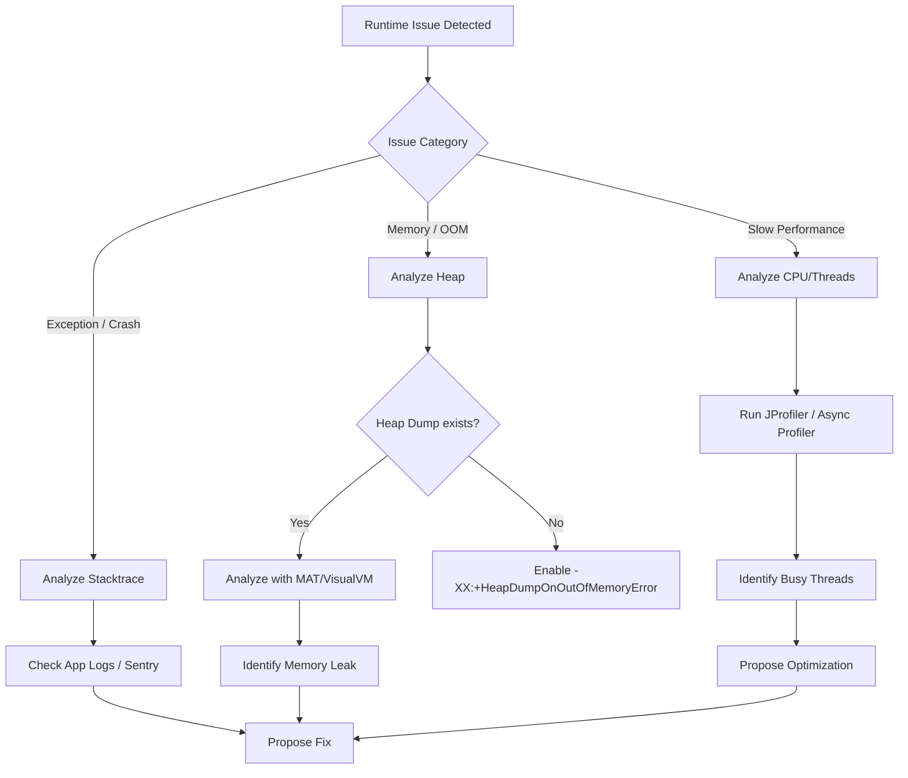

# FLOW: Java Runtime & JVM Triage

**Purpose:** Route Java runtime issues to the correct debugging or optimization path.
**Source:** `flows/JAVA_RUNTIME_TRIAGE.md`

## 1. Exception Triage
1. **Root Cause:** Find the bottom-most `Caused by:` in the stack trace.
2. **Context:** Identify the failing component (Spring Bean, Hibernate Query, etc.).
3. **Reproducer:** Write a failing `@Test` case.

## 2. JVM Memory Triage
1. **GC Logs:** Check for frequent full GCs.
2. **Heap Histogram:** `jmap -histo:live <pid>`.
3. **Leak Identification:** Look for static collections or unclosed resources (Streams, Connections).

## 3. Performance Triage
1. **Thread Dump:** `jstack <pid>` to find deadlocks or blocked threads.
2. **Sampling:** Use `jvisualvm` or `jconsole` for real-time monitoring.

## 4. Metadata
- `TRIAGE_TYPE`: RUNTIME
- `PLATFORM`: JVM
- `TOOLS`: [JVisualVM, JConsole, JStack, JMap]
