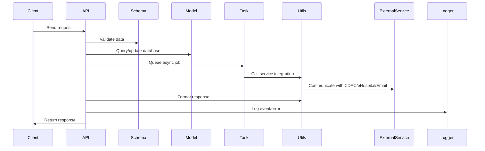

# Flow Documentation

This document provides a detailed explanation of the backend service flow, focusing on the `app` folder structure and how each component interacts to deliver API functionality, integrations, and asynchronous processing.

## app Folder Structure Overview

```
app/
├── __init__.py
├── config.py
├── extensions.py
├── models/
│   ├── __init__.py
│   ├── sms_message.py
│   └── __pycache__/
├── routes/
│   ├── __init__.py
│   ├── v1/
│   │   ├── __init__.py
│   │   ├── cdac_routes.py
│   │   ├── ehospital_routes.py
│   │   ├── mail_routes.py
│   │   ├── maintenance_routes.py
│   │   ├── sms_admin_routes.py
│   │   ├── sms_routes.py
│   │   └── __pycache__/
│   └── __pycache__/
├── schema/
│   ├── __init__.py
│   ├── sms_schema.py
│   └── __pycache__/
├── tasks/
│   ├── __init__.py
│   ├── sms_async.py
│   ├── sms_tasks.py
│   └── __pycache__/
├── utils/
│   ├── cdac_service.py
│   ├── decorators.py
│   ├── ehospital_service.py
│   ├── email_service.py
│   ├── logging_utils.py
│   ├── response.py
│   ├── sms_service.py
│   └── __pycache__/
└── __pycache__/
```

## Detailed Component Descriptions

### 1. __init__.py
Initializes the Python package for the app and its submodules.

### 2. config.py
Contains configuration settings for the application, such as environment variables, database URIs, and third-party service credentials.

### 3. extensions.py
Initializes and configures Flask extensions (e.g., database, migration, Celery, etc.) used throughout the app.

### 4. models/
Defines the data models for the application, typically using SQLAlchemy or similar ORM.
- `sms_message.py`: Model for SMS message records, including fields for sender, receiver, message content, status, and timestamps.

### 5. routes/
Defines the API endpoints for the application.
- `v1/`: Contains version 1 of the API routes, organized by service:
	- `cdac_routes.py`: Endpoints for CDAC SMS gateway integration.
	- `ehospital_routes.py`: Endpoints for eHospital system integration.
	- `mail_routes.py`: Endpoints for email-related operations.
	- `maintenance_routes.py`: Endpoints for system maintenance tasks.
	- `sms_admin_routes.py`: Endpoints for SMS administration (e.g., user management, reporting).
	- `sms_routes.py`: Endpoints for sending and managing SMS messages.

### 6. schema/
Defines data validation schemas, typically using Marshmallow or Pydantic.
- `sms_schema.py`: Schema for validating SMS message data in API requests and responses.

### 7. tasks/
Manages asynchronous tasks using Celery.
- `sms_async.py`: Async logic for SMS processing.
- `sms_tasks.py`: Task definitions for sending SMS, handling retries, and background jobs.

### 8. utils/
Provides utility functions and service integrations.
- `cdac_service.py`: Functions for interacting with the CDAC SMS gateway.
- `ehospital_service.py`: Functions for eHospital system integration.
- `email_service.py`: Functions for sending emails.
- `logging_utils.py`: Centralized logging utilities.
- `response.py`: Standardized API response formatting and error handling.
- `sms_service.py`: Core SMS sending and management logic.
- `decorators.py`: Custom decorators for authentication, authorization, and request validation.


## Main Flow Explanation (Improved)

1. **API Request**: A client sends a request to an endpoint defined in `routes/v1/`.
	- Mistake: Not validating HTTP method or endpoint existence.
	- Recommendation: Use OpenAPI/Swagger for endpoint documentation and validation.
2. **Validation**: The request data is validated using schemas from `schema/`.
	- Mistake: Incomplete schema coverage, missing edge cases.
	- Recommendation: Use strict schema validation and sanitize all inputs.
3. **Business Logic**: The route handler processes the request, interacts with models in `models/`, and may trigger async tasks in `tasks/`.
	- Mistake: Mixing business logic with route handlers, race conditions, missing permission checks.
	- Recommendation: Decouple business logic, use service layers, and enforce authorization.
4. **Async Processing**: If background processing is needed (e.g., sending SMS), a Celery task is queued and executed by worker processes.
	- Mistake: No retry logic, lost tasks, excessive privileges.
	- Recommendation: Implement retries, dead-letter queues, and least privilege for tasks.
5. **Service Integration**: Utility modules in `utils/` handle communication with external services (CDAC, eHospital, email).
	- Mistake: Tight coupling, unhandled API errors, leaking sensitive data.
	- Recommendation: Use abstraction layers, handle all errors, and sanitize logs.
6. **Response**: The result is formatted using `utils/response.py` and returned to the client.
	- Mistake: Inconsistent response structure, information leakage.
	- Recommendation: Standardize responses, avoid exposing internal errors.
7. **Logging & Error Handling**: All major actions and errors are logged using `utils/logging_utils.py` for monitoring and debugging.
	- Mistake: Logging sensitive data, catching broad exceptions, missing monitoring.
	- Recommendation: Mask sensitive info, use granular exception handling, and monitor logs.

## Additional Recommendations
- Implement authentication, authorization, and rate limiting for all endpoints.
- Use environment variables or secret managers for sensitive configs.
- Regularly update dependencies and review code for vulnerabilities.
- Write comprehensive unit and integration tests for all flows and edge cases.
- Document all changes and new features in the change log.

## Example Flow Diagram


## Summary
The `app` folder is organized for clarity, scalability, and maintainability. Each submodule has a clear responsibility, and the flow from API request to response is streamlined for robust service integration and async processing. This structure supports rapid development, easy debugging, and efficient AI-driven code updates.